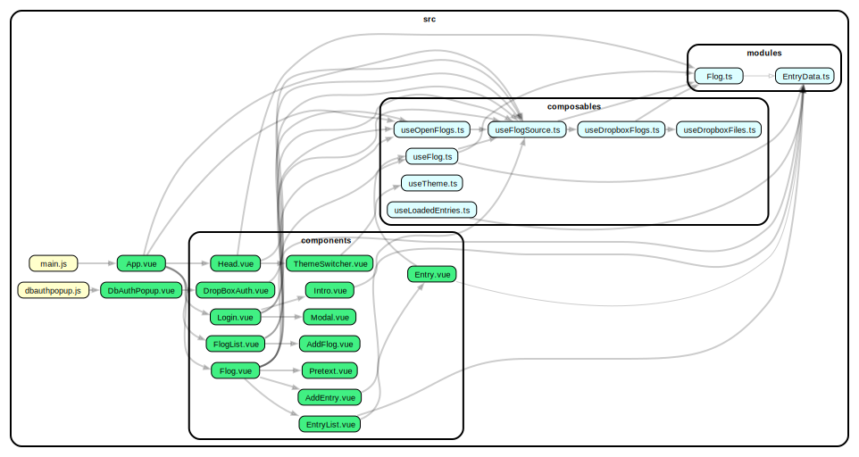
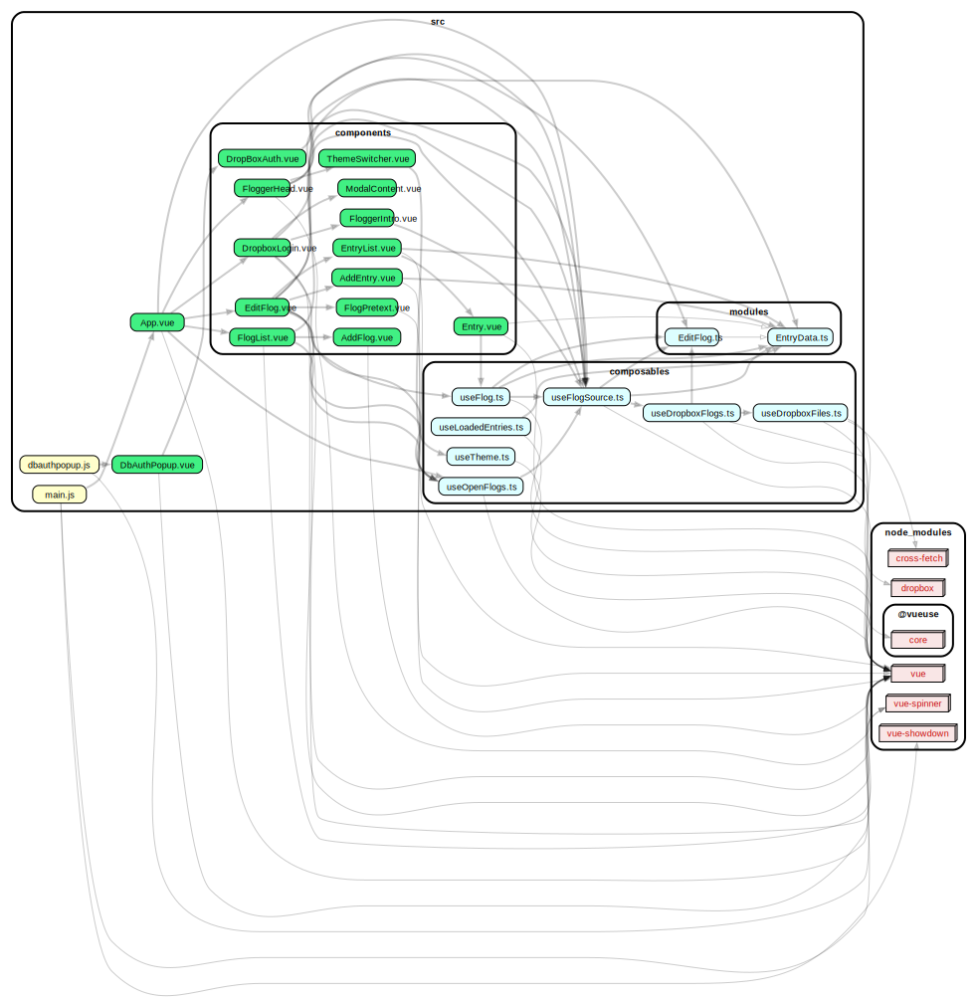

# Components


## Routes and route components

- **main** : **App** — The main app at the primary route has these components 
- **dbauthpopup** : **DbAuthPopup** — There's a second route for the Dropbox PKCE authentication and authorization flow.

## Main components

- **main** : **App**
  - **Head** — Displays the app logo and user settings menu
  - **Login** — The option to log in if not already.
  - **FlogList** — If logged in, display either a list of the user's flogs, or...
  - **Flog** — An open flog. Actually can display multiple, although the app doesn't offer an opportunity to open a second one at present.

- **dbauthpopup** : **DbAuthPopup**
  - **DropBoxAuth** — A component that shows an in progress spinner and handles the return redirect from Dropbox.

## Main components breakdown

  - **Head**
    - **ThemeSwitcher** — A light/dark mode toggler.

  - **Login**
    - **Intro** — Homepage content for unauthenticated users.
    - **Modal** — A modal is displayed while the Dropbox flow is happening in a popup.

  - **FlogList**
    - **AddFlog**

  - **Flog**
    - **Pretext**
    - **AddEntry**
    - **EntryList**
      - **Entry**


---

# App Actions

1. Entry
   1. View *
   1. Add *
   2. Edit  
   3. Delete 
2. Flogs
   1. List
   2. Create
   3. Open 
   4. Close
3. Other
   1. Connect DBX
   2. Disconnect DBX
   3. Change theme
 
# Dependency graph

## Without node_modules


## With node_modules



# Component documentation sample

```

/**
 * @description A concise description of what this component does and its purpose in the application.
 * 
 * @props {Type} propName - Description of the prop and what it's used for.
 * @props {String} title - The title displayed in the component header.
 * 
 * @emits {EventName} - Description of when this event is emitted and what data it contains.
 * @emits {update:selectedItem} - Emitted when a new item is selected, contains the item object.
 *  
 * @slots
 *   default - Description of the default slot.
 *   header - Content for the component header area.
 * 
 * @computed
 *   computedPropertyName - What this computed property returns and its purpose.
 *   filteredItems - Returns filtered items based on the search query.
 * 
 * @methods
 *   methodName(param) - What this method does and when it's called.
 *   handleSubmit() - Processes form submission and validates input.
 * 
 * @watch
 *   watchedProperty - What changes are being watched and side effects.
 *   searchQuery - Triggers new API request when search input changes.
 * 
 * @dependencies
 *   external-library - Why this dependency is needed.
 *   vuex-store-modules - Which store modules this component interacts with.
 * 
 * @example
 *   <component-name
 *     :title="'My Component'"
 *     :is-active="true"
 *     @update:selected-item="handleItemSelection"
 *   >
 *     <template #header>Custom Header Content</template>
 *     Main content goes here
 *   </component-name>
 *
 *
 * @relationships
 *   @parent ParentComponentName - Describes how this component is used within the parent component.
 *   @children
 *     - ChildComponentName - Explains the purpose of this child component.
 *   @siblings
 *     - SiblingComponent - Explains how this component interacts with sibling components.
 * @imports
 *   @components
 *     - ImportedComponent from '@/components/path/ImportedComponent.vue' - Describes its role.
 *   @composables
 *   @modules
 */
```